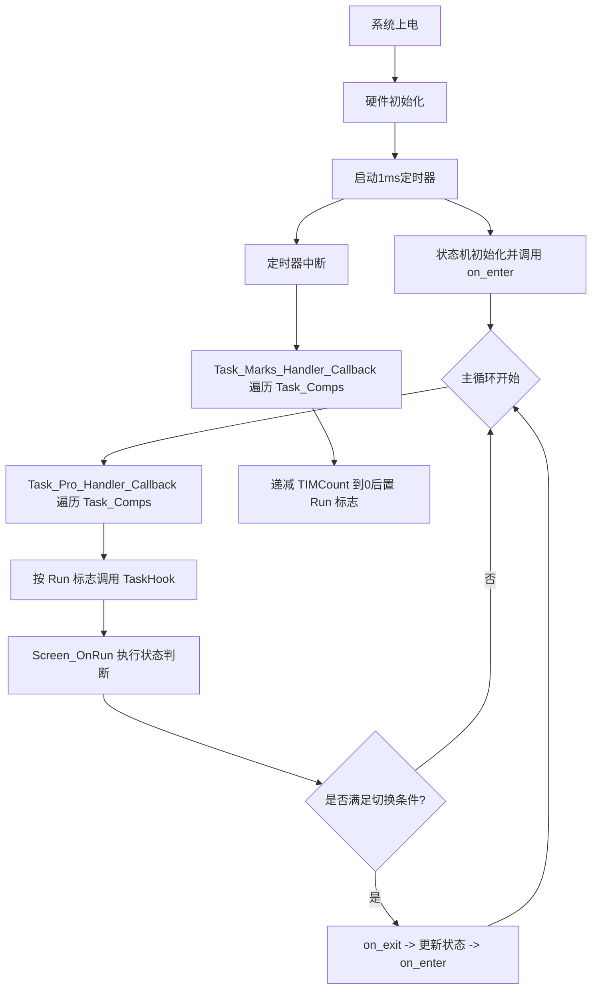

# STM32 裸机通用状态机框架组件（单定时器非阻塞轮询版）

## 🧠 核心思想

本框架面向资源受限的STM32裸机嵌入式环境（32位单片机），提供一种结构清晰、可维护性强、适合 `while(1)` 主循环的状态机方案。

- 系统行为被划分为若干**离散状态**。
- 状态之间的切换由**外部输入、超时条件、错误标志**触发。
- 遵循偏向**SWITCH分支结构**的代码架构，禁止 `goto`，状态机本体不依赖函数指针状态表。
- **禁止动态内存**：禁止 `malloc/free`，状态数据与任务标志全部使用静态或全局变量。
- **不使用消息队列**：采用 `1ms` 定时器节拍 + 任务表 + 主循环轮询派发。
- **定时器中断只做打点**：中断中只更新 `tick` 和任务标志，不在中断中直接跑业务逻辑。
- **任务调度允许函数指针**：仅在任务调度表中使用 `TaskHook` 函数指针，便于统一遍历与扩展。
- **文件分层强制执行**：业务实现代码必须写在 `.c` 文件中；函数声明、枚举定义、结构体定义必须写在 `.h` 文件中。
- **主函数强制精简**：`main.c` 只允许保留初始化、任务轮询、状态机入口，不允许堆放业务逻辑。
- **流程图模板规范**：如需在 `.md` 中生成流程图，统一使用 `Mermaid 8.8.0` 安全模板。
- 每个状态可定义三种行为：
  - **进入动作**（on_enter）：仅在进入该状态时执行一次。
  - **运行逻辑**（on_run）：在主循环中周期性执行，只做状态判断与切换。
  - **退出动作**（on_exit）：在离开该状态前执行一次。

## 🔁 整体运行流程



## 项目目录结构

```text
project/
├── main.c
├── main.h
├── User/
│   ├── Task.c                  # 任务打点与轮询派发
│   └── Task.h
├── Components/
│
│     ├── Screen.c            # 屏幕状态机
│     └── Screen.h
│   
│       ├── sensor.c
│       └── sensor.h
├── Driver/
│   └── timer_isr.c             # 定时器中断回调
└── Hal/
```

## 文件分层强制规范

- `.c` 文件：只允许放函数实现、局部静态变量、模块内部流程代码。
- `.h` 文件：必须放枚举、结构体、宏、对外函数声明、外部变量声明。
- `main.c`：只允许放系统初始化、模块初始化、`while(1)` 主循环骨架。
- 禁止把状态枚举、结构体定义、函数原型散落写进 `main.c`。
- 禁止在 `.h` 文件中写完整业务函数实现。
- 生成代码时必须优先补齐 `.h`，再补 `.c`，确保接口先清晰后实现。

## 核心代码模板

### 1. Task.h

```c
#ifndef __TASK_H
#define __TASK_H

#include <stdint.h>

//========================================================================
//                               任务表结构定义
//========================================================================

typedef struct
{
    uint8_t Run;                //任务状态，Run/Stop
    uint16_t TIMCount;          //定时计数器
    uint16_t TRITime;           //任务周期时间
    void (*TaskHook)(void);     //任务函数
} TASK_COMPONENTS;

extern volatile uint32_t g_sys_tick;
extern uint8_t Tasks_Max;

void Task_Marks_Handler_Callback(void);
void Task_Pro_Handler_Callback(void);

/* 任务函数声明建议放在各自模块头文件中，由 Task.c 通过头文件引用 */
void Task_ButtonScan(void);
void Task_BatterySample(void);
void Task_I2CProcess(void);
void Task_ScreenRefresh(void);
void Task_HeatPidStep(void);

#endif
```

### 2. Task.c

```c
#include "Task.h"

//========================================================================
//                               局部变量定义
//========================================================================

static TASK_COMPONENTS Task_Comps[] =
{
    //状态  计数  周期  任务函数
    {0U, 5U, 5U, Task_ButtonScan},
    {0U, 20U, 20U, Task_BatterySample},
    {0U, 2U, 2U, Task_I2CProcess},
    {0U, 10U, 10U, Task_ScreenRefresh},
    {0U, 1U, 1U, Task_HeatPidStep},
    /* 新任务从这里继续添加 */
};

volatile uint32_t g_sys_tick = 0U;
uint8_t Tasks_Max = sizeof(Task_Comps) / sizeof(Task_Comps[0]);

//========================================================================
// 函数: Task_Marks_Handler_Callback
// 说明: 1ms定时器中断回调函数，只做任务计数和运行标志置位。
// 输入: 无。
// 输出: 无。
//========================================================================
void Task_Marks_Handler_Callback(void)
{
    uint8_t i;

    g_sys_tick++;

    for (i = 0U; i < Tasks_Max; i++) {
        if (Task_Comps[i].TIMCount > 0U) {
            Task_Comps[i].TIMCount--;
            if (Task_Comps[i].TIMCount == 0U) {
                Task_Comps[i].TIMCount = Task_Comps[i].TRITime;
                Task_Comps[i].Run = 1U;
            }
        }
    }
}

//========================================================================
// 函数: Task_Pro_Handler_Callback
// 说明: 主循环任务处理回调函数，统一遍历任务表并执行任务函数。
// 输入: 无。
// 输出: 无。
//========================================================================
void Task_Pro_Handler_Callback(void)
{
    uint8_t i;

    for (i = 0U; i < Tasks_Max; i++) {
        if (Task_Comps[i].Run != 0U) {
            Task_Comps[i].Run = 0U;
            Task_Comps[i].TaskHook();
        }
    }
}
```

### 3. Screen.h

```c
#ifndef __SCREEN_H
#define __SCREEN_H

#include <stdint.h>

//========================================================================
//                               状态枚举定义
//========================================================================

typedef enum
{
    STATE_INIT = 0,
    STATE_IDLE,
    STATE_RUN,
    STATE_ERROR
} SCREEN_STATE;

//========================================================================
//                             对外函数声明
//========================================================================

void Screen_Init(void);
void Screen_OnRun(void);

#endif
```

### 4. Screen.c

```c
#include "Screen.h"
#include "Task.h"
#include <stdio.h>

static SCREEN_STATE Scr_State = STATE_INIT;
static uint32_t Scr_EnterTick = 0U;

static void Screen_OnEnter(SCREEN_STATE state);
static void Screen_OnExit(SCREEN_STATE state);
static void Screen_ChangeState(SCREEN_STATE NextState);

//========================================================================
// 函数: Screen_OnEnter
// 说明: 状态进入处理函数，只在进入状态时执行一次。
// 输入: state，当前要进入的状态。
// 输出: 无。
//========================================================================
static void Screen_OnEnter(SCREEN_STATE state)
{
    switch (state) {
        case STATE_INIT:
            Scr_EnterTick = g_sys_tick;
            printf("Screen: Enter INIT state\n");
            break;

        case STATE_IDLE:
            Scr_EnterTick = g_sys_tick;
            printf("Screen: Enter IDLE state\n");
            break;

        case STATE_RUN:
            Scr_EnterTick = g_sys_tick;
            printf("Screen: Enter RUN state\n");
            break;

        case STATE_ERROR:
            Scr_EnterTick = g_sys_tick;
            printf("Screen: Enter ERROR state\n");
            break;

        default:
            break;
    }
}

//========================================================================
// 函数: Screen_OnExit
// 说明: 状态退出处理函数，在状态切换前执行一次。
// 输入: state，当前准备退出的状态。
// 输出: 无。
//========================================================================
static void Screen_OnExit(SCREEN_STATE state)
{
    switch (state) {
        case STATE_INIT:
            break;

        case STATE_RUN:
            break;

        default:
            break;
    }
}

//========================================================================
// 函数: Screen_ChangeState
// 说明: 统一状态切换接口，避免状态转移逻辑分散。
// 输入: NextState，目标状态。
// 输出: 无。
//========================================================================
static void Screen_ChangeState(SCREEN_STATE NextState)
{
    if (NextState != Scr_State) {
        Screen_OnExit(Scr_State);
        Scr_State = NextState;
        Screen_OnEnter(Scr_State);
    }
}

//========================================================================
// 函数: Screen_OnRun
// 说明: 状态机运行函数，只做状态判断和状态切换。
// 输入: 无。
// 输出: 无。
//========================================================================
void Screen_OnRun(void)
{
    switch (Scr_State) {
        case STATE_INIT:
            if ((g_sys_tick - Scr_EnterTick) >= 100U) {
                Screen_ChangeState(STATE_IDLE);
            }
            break;

        case STATE_IDLE:
            if (Key_IsPressed() != 0U) {
                Screen_ChangeState(STATE_RUN);
            }
            break;

        case STATE_RUN:
            if (System_HasError() != 0U) {
                Screen_ChangeState(STATE_ERROR);
            }
            break;

        case STATE_ERROR:
            if (Error_IsRecovered() != 0U) {
                Screen_ChangeState(STATE_IDLE);
            }
            break;

        default:
            break;
    }
}

//========================================================================
// 函数: Screen_Init
// 说明: 屏幕状态机初始化函数，完成初始状态装载。
// 输入: 无。
// 输出: 无。
//========================================================================
void Screen_Init(void)
{
    Scr_State = STATE_INIT;
    Screen_OnEnter(Scr_State);
}
```

### 5. 定时器中断 (timer_isr.c)

```c
#include "Task.h"

void TIM6_Update_IRQHandler(void)
{
    /* 清除TIM6更新中断标志 */
    Timer6_ClearUpdateFlag();
    Task_Marks_Handler_Callback();
}
```

### 6. 主程序 (main.c)

```c
#include "Screen.h"
#include "Task.h"

int main(void)
{
    HAL_Init();
    Timer6_Init_1ms();
    Screen_Init();

    while (1) {
        /* main中只保留任务轮询和状态机入口 */
        Task_Pro_Handler_Callback();
        Screen_OnRun();
    }
}
```

## ✅ 推荐设计原则

| 原则                        | 说明                                                          |
| --------------------------- | ------------------------------------------------------------- |
| **状态职责单一**      | 每个状态只做一类事情，避免逻辑混杂                            |
| **转移显式声明**      | 使用 `switch-case` 显式定义所有状态转移                     |
| **定时器只打点**      | 中断只维护 `tick` 和任务运行标志，不直接跑业务              |
| **主循环顺序轮询**    | 主循环固定顺序执行任务：按钮→电池→I2C→屏幕→PID            |
| **无消息队列**        | 不引入事件队列，直接用定时器标记 + 条件判断                   |
| **任务表统一派发**    | 任务通过 `TASK_COMPONENTS` 和 `Task_Comps` 统一管理和调用 |
| **函数指针仅限调度**  | 只在任务表中使用 `TaskHook`，状态机转移仍用 `switch-case` |
| **`.h` 放声明定义** | 枚举、结构体、函数声明必须优先写入头文件                      |
| **`.c` 放实现代码** | 状态动作、任务处理、流程控制必须写在源文件中                  |
| **`main` 必须精简** | 主函数只保留初始化和调度入口，不承载业务实现                  |
| **超时即条件**        | 在 `on_run` 中利用 `tick` 判断超时并切换状态              |
| **避免阻塞**          | 不使用 `HAL_Delay(1)`，所有任务都必须非阻塞                 |

## 🎯 总结

本架构把“任务周期调度”和“状态切换逻辑”拆开处理：

- **任务调度**：借鉴 `Task_Marks_Handler_Callback()` + `Task_Pro_Handler_Callback()` 的做法，采用任务表统一打点与统一派发。
- **状态机**：保留 `on_enter/on_run/on_exit` 生命周期，所有转移集中在一个 `switch-case` 中实现。
- **文件组织**：强制要求“`.h` 放声明和枚举，`.c` 放实现，`main.c` 极简化”。
- **适配单核裸机**：不需要 FreeRTOS，不需要消息队列，任务调度层允许使用函数指针以简化扩展。
- **响应更及时**：去掉 `HAL_Delay(1)` 后，主循环可以持续轮询，状态变化和故障处理更及时。
